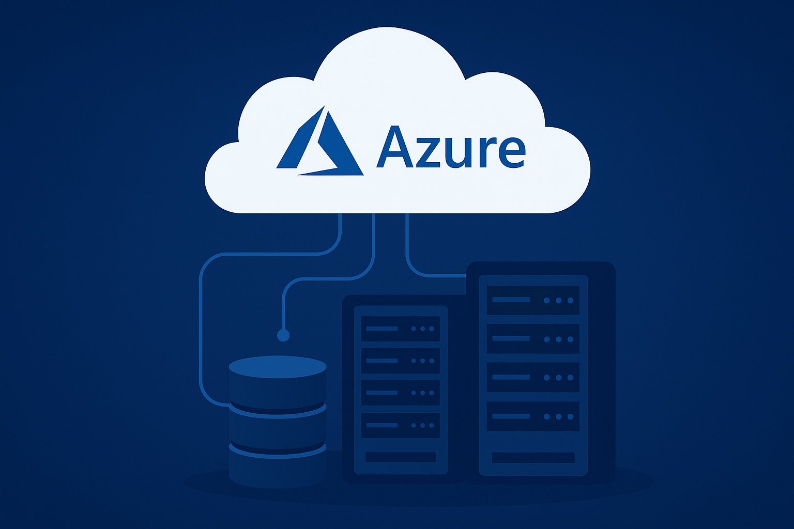

<!-- Banner -->

  

<h1 align="center">💡 Melhorando a Eficiência e Escalabilidade com Máquinas Virtuais do Azure</h1>

  
  
  

---

## 📚 Sumário

1. [Introdução](#-introdução)
2. [Conceito de Eficiência e Escalabilidade](#-conceito-de-eficiência-e-escalabilidade)
3. [O que são Máquinas Virtuais do Azure](#-o-que-são-máquinas-virtuais-do-azure)
4. [Criando uma Máquina Virtual no Portal do Azure](#-criando-uma-máquina-virtual-no-portal-do-azure)
5. [Conectando-se à Máquina Virtual](#-conectando-se-à-máquina-virtual)
6. [Instalando o Servidor Web IIS](#-instalando-o-servidor-web-iis)
7. [Limpando os Recursos e Gerenciando Custos](#-limpando-os-recursos-e-gerenciando-custos)
8. [Como Isso Melhora Eficiência e Escalabilidade](#-como-isso-melhora-eficiência-e-escalabilidade)
9. [Referências](#-referências)

---

## 🚀 Introdução

A **computação em nuvem** permite criar, gerenciar e escalar recursos de forma rápida e eficiente.  
O **Microsoft Azure** oferece um conjunto robusto de ferramentas que facilitam a criação de **Máquinas Virtuais (VMs)** — fundamentais para rodar aplicações de forma flexível e com alta disponibilidade.

Este guia demonstra como **criar uma máquina virtual do Windows no portal do Azure**, conectá-la via **RDP**, instalar o **IIS (servidor web)** e aplicar boas práticas de **eficiência e escalabilidade**.

---

## ⚙️ Conceito de Eficiência e Escalabilidade

- **Eficiência**: Utilizar recursos de forma otimizada, evitando desperdícios de processamento, memória ou custos.  
- **Escalabilidade**: A capacidade de aumentar ou reduzir recursos conforme a demanda, sem prejudicar o desempenho.  

O Azure permite aplicar esses conceitos de maneira prática através de **máquinas virtuais configuráveis e automatizadas**.

---

## 🖥️ O que são Máquinas Virtuais do Azure

As **VMs (Virtual Machines)** são instâncias virtuais de servidores que rodam no Azure.  
Elas permitem:

- Escolher sistema operacional (Windows, Linux, etc.);  
- Ajustar CPU, memória e armazenamento conforme a necessidade;  
- Controlar acessos, rede e políticas de segurança;  
- Redimensionar automaticamente em cenários de pico.

---

## 🧩 Criando uma Máquina Virtual no Portal do Azure

### Passo a passo

1. **Acesse o Portal do Azure**  
   [https://portal.azure.com](https://portal.azure.com)

2. **Pesquise por "Máquinas Virtuais"** e clique em **Criar > Máquina Virtual do Azure**.

3. **Preencha os detalhes da instância:**
   - **Nome:** `myVM`  
   - **Imagem:** `Windows Server 2022 Datacenter: Azure Edition - x64 Gen 2`  
   - **Região:** escolha a mais próxima (ex: Brazil South)  
   - **Tamanho:** escolha um tipo compatível com seu uso (ex: Standard_B1s)

4. **Conta de administrador:**
   - Usuário: `azureuser`
   - Senha: (mínimo 12 caracteres)

5. **Regras de porta de entrada:**
   - Selecione **Permitir portas selecionadas**
   - Habilite: `RDP (3389)` e `HTTP (80)`

6. Clique em **Examinar + criar** e depois em **Criar**.

> ⚠️ **Importante:** Esse procedimento é para aprendizado, não indicado para ambientes de produção.

---

## 🔗 Conectando-se à Máquina Virtual

Após a criação:

1. Vá até sua VM e clique em **Conectar > RDP**  
2. Baixe o arquivo `.rdp` e abra no seu computador.  
3. Use as credenciais definidas anteriormente:
4. Aceite o certificado, se solicitado.

> 💡 **Dica:** Usuários de Mac podem usar o [Cliente RDP da Mac App Store](https://apps.apple.com/br/app/microsoft-remote-desktop/id1295203466).

---

## 🌐 Instalando o Servidor Web IIS

Depois de conectado à VM via RDP, abra o **PowerShell** e execute:

powershell

Install-WindowsFeature -name Web-Server -IncludeManagementTools

http://<endereço_IP_da_VM>

---

## 🧹 Limpando os Recursos e Gerenciando Custos

Se não precisar mais da **máquina virtual (VM)**:

1. Vá até o **Grupo de Recursos** da VM.  
2. Clique em **Excluir grupo de recursos**.  
3. Confirme a exclusão para liberar os recursos e evitar cobranças.  

---

### 💤 Habilitar Desligamento Automático

1. Vá até sua **VM** → **Operações > Desligamento Automático**  
2. Ative a opção e **defina o horário desejado**  
3. Clique em **Salvar**

---

🔒 **Dica:** Isso evita custos desnecessários e melhora a **eficiência operacional**.

---

## 🚀 Como Isso Melhora Eficiência e Escalabilidade

A criação e o gerenciamento de **Máquinas Virtuais no Azure** trazem eficiência operacional e escalabilidade sob demanda, pois:

- ✅ **Escalabilidade:** você pode aumentar ou reduzir recursos (CPU, RAM, armazenamento) conforme a necessidade.  
- ⚡ **Eficiência:** recursos são alocados apenas quando necessários, reduzindo desperdícios.  
- 💰 **Otimização de custos:** você paga apenas pelo uso (modelo baseado em consumo).  
- 🧠 **Automação:** o Azure permite automação de deploys, backups e monitoramento.  
- 🌍 **Disponibilidade global:** com datacenters distribuídos, é possível implantar VMs próximas dos usuários finais.  

📘 **Exemplo prático:** Um servidor web em **IIS** pode ser replicado em múltiplas regiões do Azure e integrado a um **balanceador de carga**, garantindo alto desempenho e tolerância a falhas.

---

📚 **Referências**

- [Documentação oficial do Azure Virtual Machines](https://learn.microsoft.com/en-us/azure/virtual-machines/)
- [Criar rapidamente uma VM Windows no Azure Portal](https://learn.microsoft.com/en-us/azure/virtual-machines/windows/quick-create-portal)
- [Gerenciar custos no Azure](https://learn.microsoft.com/en-us/azure/cost-management-billing/)
- [Introdução ao IIS](https://learn.microsoft.com/en-us/iis/get-started/)

---

📘 **Autor:** Roberto Emílio Mariano de Rezende  
📅 **Ano:** 2025  
